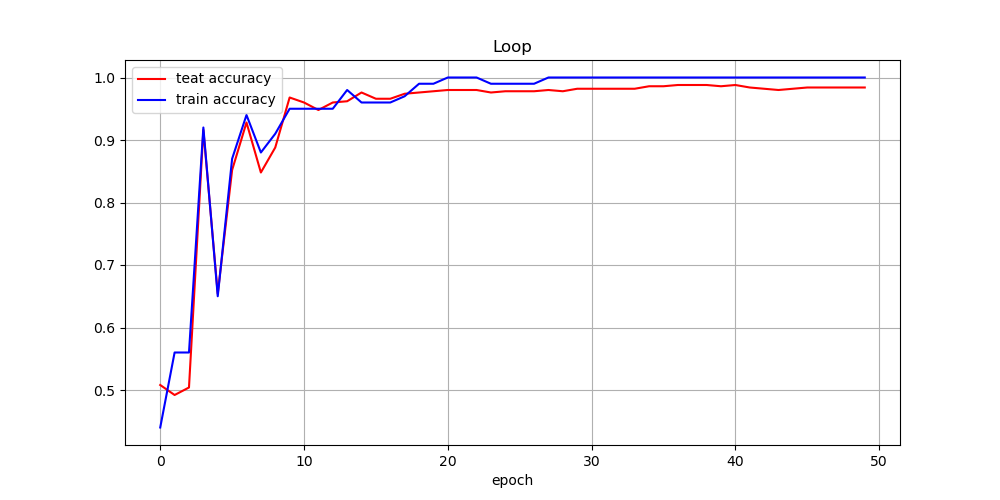

# Raw data compared with normal and fault data

## knowlage graph

# GAT model for diesel engine fault diagnosis results

# CNN model for diesel engine fault diagnosis results

# LSTM model for diesel engine fault diagnosis results

